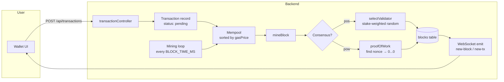

# 01 — Blockchain Miner (PoW + PoS Engine)

## TL;DR

Ledger Link runs a **simulated blockchain inside PostgreSQL**. Every transaction goes into a mempool, gets bundled into a block, hashed with SHA-256, summarised by a Merkle root, and validated by a stake-weighted Proof-of-Stake (PoS) consensus. We support PoW too as a switchable mechanism.

No external chain is needed for the demo — but the data model, hashing, mempool, gas calculation and consensus all match real blockchains, so concepts like block confirmations, hash chains and gas fees are real.

## Why we built our own engine

| Problem with using a public chain (Ethereum/Polygon) for a final-year project | Our solution |
|---|---|
| Costs real money (gas fees) for every demo | Free; runs in our own DB |
| Slow finality (15s+ on mainnet) | Configurable: `BLOCK_TIME_MS=12000` (default) |
| Examiner cannot inspect node internals | We control mining, mempool ordering, validator selection |
| No way to demo PoW vs PoS comparison | Single env switch (`consensus.mechanism`) |

We kept everything that matters for the academic story — hashing, Merkle trees, mempool, gas — and dropped what doesn't (real economic security, P2P networking).

## Core concepts (explained)

### 1. SHA-256 hashing
Every block has a unique 64-character hex fingerprint produced by SHA-256. Inputs are concatenated as `blockNumber + previousHash + merkleRoot + nonce + timestamp`. Change one byte → completely different hash. This is what makes the chain *immutable*.

### 2. Merkle Tree
We don't store all transaction hashes inside the block header — we store one **Merkle root** that summarises them. Pair-hash, pair-hash, pair-hash until you have a single hash at the top. Benefit: a node can prove "transaction X is in block Y" with just `log2(N)` hashes instead of all of them.

```
        ROOT (merkleRoot)
       /     \
     H12     H34
    /   \   /   \
  TX1  TX2 TX3  TX4
```

### 3. Mempool
A pending-transaction queue sorted by gas price (highest first). Same model as Bitcoin/Ethereum. Real wallet sends land here, then a miner pulls up to 50 of them per block.

### 4. Proof of Stake (default)
Five hardcoded validators each have a stake (e.g. 32, 48, 64, 96, 50 ETH). For each new block we pick a validator using **stake-weighted random selection**: validators with more stake are picked more often. No CPU burned, no electricity wasted — just a probability draw.

### 5. Proof of Work (switchable)
Find a `nonce` so that `SHA-256(block + nonce)` starts with `difficulty` zeros. We cap iterations at 10000 so the demo doesn't hang the server. Difficulty auto-adjusts every 10 blocks.

### 6. Dynamic Gas
Gas is *not* a flat fee. It's:
```
gas_used = base_cost(tx_type) + (data_size × 16)
gas_price = 20 Gwei (base) + random(0..5 Gwei priority tip)
```
Token transfers (`65000`) cost more than ETH transfers (`21000`); contract creation (`53000`); complex op (`100000`).

## Architecture



## Backend implementation

| Concern | File:line |
|---|---|
| Service | `src/services/SimulatedBlockchainService.ts` |
| Genesis block | `createGenesisBlock()` ~line 124 |
| Mempool sort | `addToMempool()` ~line 395 |
| PoS validator selection | `selectValidator()` ~line 241 |
| PoW loop | `proofOfWork()` ~line 299 |
| Block mining | `mineBlock()` ~line 329 |
| Mining tick | `processMempool()` ~line 423 |
| Difficulty adjustment | `adjustDifficulty()` (every 10 blocks) |
| Merkle root | `calculateMerkleRoot()` ~line 210 |
| Gas calculation | `static calculateGas()` ~line 264 |
| Controller | `src/controllers/blockchainController.ts` |
| Entity | `src/entities/Block.ts` |

## API endpoints

| Method | Path | Purpose |
|---|---|---|
| GET | `/api/blockchain/blocks` | Paginated list of blocks |
| GET | `/api/blockchain/blocks/latest` | Latest mined block |
| GET | `/api/blockchain/blocks/:identifier` | Block by number or hash |
| GET | `/api/blockchain/blocks/:blockNumber/transactions` | Txs inside a block |
| GET | `/api/blockchain/mempool` | Currently pending txs |
| GET | `/api/blockchain/stats` | totalBlocks, hashRate, difficulty, validators |
| GET | `/api/blockchain/verify` | Re-hash chain & confirm integrity |

## Frontend pages

| Page | Path | Shows |
|---|---|---|
| Explorer | `/dashboard/explorer` | Search any block / hash |
| Blocks | `/dashboard/blocks` | Latest blocks, miner, gas, tx count |
| Live | `/dashboard/live` | Real-time WS feed of new blocks/txs |
| Network | `/dashboard/network` | Validators, hash rate, difficulty |

## Demo walkthrough

1. Open the **Send** page → send 0.1 ETH to any address.
2. Open **Live** in another tab — within `BLOCK_TIME_MS` you see:
   - `mempool-update` → size 1
   - `new-block` → block #N with hash starting `0x...`
   - `new-transaction` event with status `confirmed`
3. Click the block hash → opens **Explorer** with full block detail (Merkle root, validator address, gas used).
4. Hit `/api/blockchain/verify` → returns `{ valid: true }` proving the entire chain re-hashes cleanly.

## Env vars that affect mining

| Var | Default | Effect |
|---|---|---|
| `BLOCK_TIME_MS` | `12000` | Time between mining cycles. Increase to slow down DB writes (Render free tier). |
| `MINE_EMPTY_BLOCKS` | `true` | Set `false` to only mine when the mempool has txs (saves storage). |
