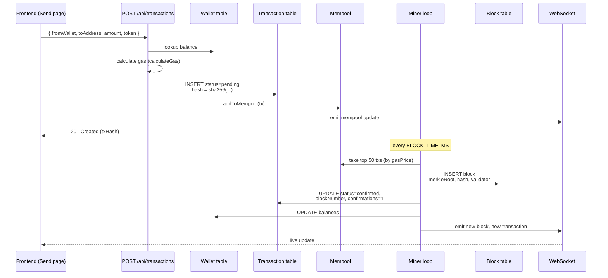

# 02 — Transactions, Wallets & Payment Requests

## TL;DR

Users have **wallets** (each with a hex address) and **balances** per token (ETH/BTC/USDT/...). Sending money creates a `Transaction` row → enters the mempool → gets mined into a block → status flips from `pending` → `confirmed`. Payment requests are reverse-direction: user A asks user B to pay them.

## Why transactions are not just DB updates

A naïve approach would be: `UPDATE wallets SET balance = balance - amount`. We don't do that because:

1. **Auditability** — every value movement must be reproducible from an immutable history.
2. **Atomicity in the eyes of the chain** — until the tx is in a block, it has no real existence.
3. **Status machine** — `pending → confirmed → finalized` mirrors how real chains work and lets the UI show progress.

Every send writes:
- a `Transaction` row (status=pending)
- pushes a mempool entry
- after mining → updates balances on both wallets, stamps `blockNumber` + `confirmations`

## Concepts

### Transaction hash
A SHA-256 over `from + to + amount + token + nonce + timestamp`. Acts as the universal ID — searchable on the explorer, used to look up the tx in any block.

### Gas vs gas price
- **Gas used** = how much computational work this tx represents (`21000` for ETH transfer, `65000` for token transfer).
- **Gas price** = price per gas unit, in wei. Higher gas price = mined first.
- **Total fee** = `gasUsed × gasPrice`.

### Confirmations
Once a tx is in block N, every new block that gets mined increments its confirmation count. Generally 6+ confirmations = safe to trust.

### Payment Request
A *request* is the inverse direction. User A creates a request `{from: B, amount: 50 USDT}`. B sees it in their inbox and can either pay (which creates a normal transaction) or ignore it.

## Send flow

## Backend implementation

| Concern | File:line |
|---|---|
| Send a transaction | `src/controllers/transactionController.ts` POST `/` ~line 31 |
| List user txs | `transactionController.ts` GET `/` ~line 92 |
| Tx by ID / hash | GET `/:id`, `/hash/:hash` |
| Wallet send (helper) | `src/controllers/walletController.ts` POST `/:walletId/send` |
| Payment request create | `src/controllers/paymentRequestController.ts` POST `/` |
| Mempool integration | `SimulatedBlockchainService.addToMempool()` |
| Mining → confirmation | `SimulatedBlockchainService.processMempool()` |
| Entity | `src/entities/Transaction.ts` |
| Frontend send page | `ledger-link-frontend/app/dashboard/send/page.tsx` |
| Frontend tx list | `ledger-link-frontend/app/dashboard/transactions/page.tsx` |
| Frontend payment requests | `ledger-link-frontend/app/dashboard/receive/page.tsx` |

## API endpoints

### Transactions
| Method | Path | Purpose |
|---|---|---|
| POST | `/api/transactions` | Create + broadcast a transaction |
| GET | `/api/transactions` | List user's txs (paginated) |
| GET | `/api/transactions/:id` | Tx by UUID |
| GET | `/api/transactions/hash/:hash` | Tx by SHA-256 hash |
| GET | `/api/transactions/stats` | Aggregate stats |

### Wallets
| Method | Path | Purpose |
|---|---|---|
| POST | `/api/wallets/create` | Generate new wallet |
| GET | `/api/wallets` | List user wallets |
| GET | `/api/wallets/:walletId/balances` | All token balances |
| POST | `/api/wallets/:walletId/send` | Send (wallet-scoped) |
| POST | `/api/wallets/:walletId/faucet` | Demo faucet — top up |

### Payment requests
| Method | Path | Purpose |
|---|---|---|
| POST | `/api/payment-requests` | Create a request |
| GET | `/api/payment-requests` | Inbox + outbox |
| PUT | `/api/payment-requests/:id/cancel` | Cancel pending request |
| PUT | `/api/payment-requests/:requestId/complete` | Pay & complete |

## Demo walkthrough

1. Open **Send** → choose ETH → enter 0.05 → recipient hex.
2. UI shows "Broadcasting..." and the tx hash.
3. Switch to **Live** — see the tx appear in mempool, then in the next block.
4. Switch to **Transactions** — your tx now shows status `confirmed` with `1 confirmation`. Refresh in 12s — count goes up.
5. Switch to **Receive** → "Request Payment" → fill in the other user → they see it in their inbox.
