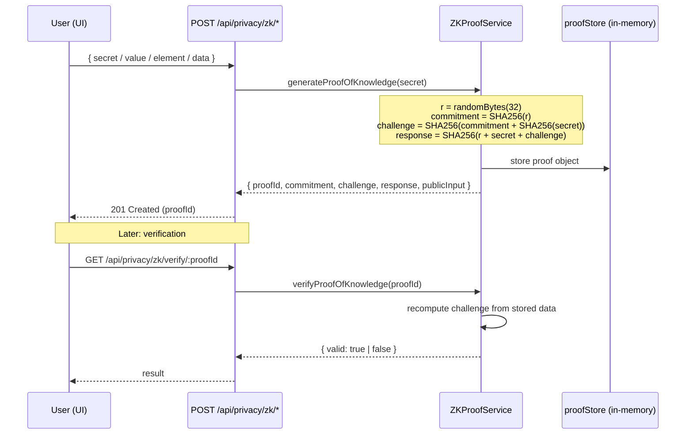

# 03 — Zero-Knowledge Proofs

## TL;DR

A **zero-knowledge proof (ZKP)** lets you prove a statement is true *without revealing why*. Ledger Link implements four flavours: **knowledge**, **range**, **membership**, and **integrity** — all simulated with SHA-256 commitments and the Fiat-Shamir heuristic for non-interactive verification.

## Why ZK proofs matter (the killer use case)

Imagine you want to prove to a bank you're over 18, without revealing your birthday. Or prove your salary is over $50k for a loan, without showing the exact figure. Or prove a healthcare record belongs to a specific patient, without exposing the record contents. **That's ZKP.**

For a blockchain project the value is huge: you can verify financial claims, regulatory compliance, or data ownership *on-chain* without exposing private data.

| Without ZKP | With ZKP |
|---|---|
| Bank sees your full income statement | Bank sees only "income > $50k = TRUE" |
| Healthcare record exposed during audit | Auditor confirms record was unchanged, never reads it |
| Identity verification leaks PII | "User is in approved set" — set never revealed |

## The four proof types we implement

### 1. Proof of Knowledge (Schnorr-style)

> "I know a secret X — and I'll prove it to you without telling you what X is."

**Steps (Fiat-Shamir non-interactive variant):**
1. **Commit:** prover picks random nonce r, publishes `commitment = SHA256(r)`.
2. **Challenge:** instead of asking the verifier, derive the challenge from the commitment + public input (`SHA256(commitment || pubInput)`). This makes the proof non-interactive.
3. **Response:** prover publishes `SHA256(r || secret || challenge)`.
4. **Verify:** verifier recomputes the challenge — if it matches, the prover must have known the secret.

### 2. Range Proof

> "My value is between 18 and 99 (without telling you my actual age)."

Used for: age verification, credit limit checks, "balance > minimum" claims.

### 3. Membership Proof

> "My ID is in the approved-users set (without revealing which ID)."

Used for: whitelisting, KYC compliance, anonymous access control.

### 4. Integrity Proof

> "This data has not been tampered with since I committed to its hash."

Used for: healthcare records, supply chain hand-offs, document notarisation.

## Why "simulated"?

Production ZK systems (zk-SNARKs, Bulletproofs, PLONK) use elliptic curves and pairings — months of crypto engineering. Our project's goal is to **demonstrate the protocol structure** (commit → challenge → response → verify) so a viewer understands *what's happening*, not to ship a production crypto library. Every property of a real ZKP is mirrored in our SHA-256 simulation: zero-knowledge (response leaks no info), soundness (wrong secret fails verification), completeness (right secret always passes).

## Architecture



## Backend implementation

| Concern | File:line |
|---|---|
| Service | `src/services/ZKProofService.ts` |
| Proof of knowledge | `generateProofOfKnowledge()` ~line 38 |
| Range proof | `generateRangeProof()` ~line 94 |
| Membership proof | `generateMembershipProof()` ~line 136 |
| Integrity proof | `generateIntegrityProof()` ~line 176 |
| Verification | `verifyProofOfKnowledge()` ~line 75 |
| Controller | `src/controllers/privacyController.ts` |
| Frontend page | `ledger-link-frontend/app/dashboard/privacy/page.tsx` |

## API endpoints

| Method | Path | Body | Purpose |
|---|---|---|---|
| POST | `/api/privacy/zk/proof-of-knowledge` | `{ secret }` | Prove you know a secret |
| POST | `/api/privacy/zk/range-proof` | `{ value, min, max }` | Prove value in range |
| POST | `/api/privacy/zk/membership-proof` | `{ element, set: [...] }` | Prove element ∈ set |
| POST | `/api/privacy/zk/integrity-proof` | `{ data }` | Prove data unchanged |
| GET | `/api/privacy/zk/verify/:proofId` | — | Verify any proof |
| GET | `/api/privacy/zk/proofs` | — | List all proofs |

## Sample proof object

```json
{
  "proofId": "8e9c...",
  "commitment": "ab12cd34...",   // SHA256 of random nonce
  "challenge":  "ef56a890...",   // derived non-interactively (Fiat-Shamir)
  "response":   "12fe98ba...",   // proves knowledge without leaking secret
  "publicInput":"34cd56ef...",   // SHA256(secret) — what we are proving knowledge of
  "verified":   true,
  "proofType":  "knowledge",
  "timestamp":  1745152812341
}
```

## Demo walkthrough

1. Open **Privacy** tab.
2. **Proof of Knowledge** → enter "myPassword123" → click Generate. UI shows the four hex blobs.
3. Copy `proofId` → click Verify → returns `valid: true`.
4. **Range Proof** → value=25, min=18, max=99 → Generate → returns `verified=true` (you've proved you're an adult without revealing the value).
5. Try value=15, min=18 → `verified=false` (soundness — wrong claims fail).
6. **Integrity Proof** → paste a string → store the proof. Later, hash the same string and confirm it matches — that's how the healthcare module ensures records weren't tampered with.

## Why this is a strong demo angle

The viewer can see, in plain hex, the *exact* commit/challenge/response triples that constitute a ZK proof. There is no magic library hiding the math — every line is `crypto.createHash('sha256')`. This makes the cryptographic intuition explicit, which is the whole point of the academic exercise.
