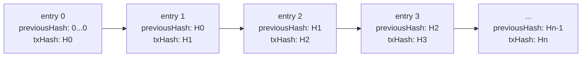

# 04 — Privacy & Audit Trail

## TL;DR

Two complementary primitives:
- **AES-256-CBC** symmetric encryption protects record contents at rest.
- **Hash-chained audit log** (linked SHA-256) makes every action traceable and tamper-evident.

Together they give us *confidentiality* (only authorised users can read data) and *integrity* (any historical edit is detectable).

## Why both?

Encryption alone hides *what* was stored, but not *what was done*. An attacker with database write access could insert/modify/delete records silently. So we encrypt the data **and** hash-chain every operation against it.

| Threat | Mitigation |
|---|---|
| DB dump leak | AES-256-CBC — ciphertext is useless without the 32-byte key |
| Insider quietly edits a row | Audit chain breaks — re-verification flags it |
| Lost decryption key | Records are unrecoverable (intentional — no backdoor) |
| Replay attack on audit log | Each entry pulls in the previous hash — out-of-order or removed entries break the chain |

## AES-256-CBC explained

| Term | Meaning |
|---|---|
| **AES** | Advanced Encryption Standard — the NIST-approved symmetric block cipher used worldwide. |
| **256** | Key size in bits. Brute-forcing 2^256 keys is infeasible with any conceivable computing power. |
| **CBC** | Cipher Block Chaining — each plaintext block is XORed with the previous ciphertext block before encryption. Stops identical plaintext blocks from producing identical ciphertext. |
| **IV** | 16-byte random Initialization Vector. Makes the first block unique per encryption — the same plaintext + same key + different IV → completely different ciphertext. |

**Encryption recipe used in `HealthRecordService`:**
```ts
const iv = crypto.randomBytes(16);
const cipher = crypto.createCipheriv('aes-256-cbc', key32bytes, iv);
let encrypted = cipher.update(plaintext, 'utf8', 'hex');
encrypted += cipher.final('hex');
return { encrypted, iv: iv.toString('hex') };
```
We store `encrypted` *and* the per-record `iv` in the DB. The 32-byte `ENCRYPTION_KEY` lives in env vars only.

## Hash-chained audit log

Every audit entry stores `previousHash` of the entry before it. Combined, they form a linked list where each link is cryptographic.



**Tamper detection:** if anyone alters entry 1, its `txHash` changes. Entry 2 still claims `previousHash = H1_old`, so the chain breaks at entry 2 — `GET /api/audit/verify` returns the exact entry where it broke. There is no way to silently modify history without re-hashing every subsequent entry, and even that requires DB write access *and* code-level cooperation.

This is the same construction Bitcoin's block chain uses, applied to audit events instead of transactions.

## RBAC (Role-Based Access Control)

Three roles: `user`, `admin`, `provider`. Enforced by middleware:
```ts
router.get('/verify', authenticateToken, requireRole(['admin']), ...)
```
Audit verification, for example, is admin-only — a normal user can read their own log entries but can't run a global integrity check.

## Architecture

```mermaid
flowchart TB
    subgraph App["Any service action"]
        A1[transactionController.send]
        A2[healthRecordController.create]
        A3[supplyChainController.transfer]
    end

    A1 -->|auditService.log| AS
    A2 -->|auditService.log| AS
    A3 -->|auditService.log| AS

    subgraph Audit["AuditService"]
        AS[log&#40;event&#41;]
        AS -->|previousHash = lastHash| LH[in-memory lastHash]
        AS -->|txHash = SHA256&#40;event + prevHash + ts&#41;| H[compute hash]
        H --> DB[(audit_logs)]
        DB --> LH
    end

    subgraph Verify["Periodic / on-demand verify"]
        V[GET /api/audit/verify] -->|admin only| LOOP[walk all rows in order]
        LOOP -->|recompute every previousHash| OK{matches?}
        OK -->|yes| GOOD[chain intact]
        OK -->|no| BAD[report broken entry id]
    end
```



## Backend implementation

| Concern | File:line |
|---|---|
| Audit service | `src/services/AuditService.ts` |
| Hash chain logic | `log()` ~line 33; `verifyIntegrity()` ~line 102 |
| AES-256-CBC encrypt/decrypt | `HealthRecordService.encrypt/decrypt` ~line 22 |
| RBAC middleware | `src/middleware/auth.ts` `requireRole()` |
| Audit controller | `src/controllers/auditController.ts` |
| Privacy controller (ZK) | `src/controllers/privacyController.ts` |
| Frontend privacy page | `ledger-link-frontend/app/dashboard/privacy/page.tsx` |
| Audit log entity | `src/entities/AuditLog.ts` |

## API endpoints (audit only — ZK is in [03-zk-proofs.md](./03-zk-proofs.md))

| Method | Path | Auth | Purpose |
|---|---|---|---|
| GET | `/api/audit/logs` | user | List own audit entries (filter by entityType/action) |
| GET | `/api/audit/verify` | admin | Walk full chain & report integrity |
| GET | `/api/audit/stats` | user | Counts by action and entity type |

## Demo walkthrough

1. Send a transaction → check **Audit** tab → entry appears with `action=transaction.create`.
2. Send another → another entry with `previousHash` = `txHash` of the previous entry.
3. Manually edit one row in DB (e.g. change the description).
4. Hit `GET /api/audit/verify` → it returns `valid: false` and points to the exact log id that broke.
5. Restore the row → re-verify → `valid: true`.

## Env vars

| Var | Purpose |
|---|---|
| `ENCRYPTION_KEY` | 32-byte string used as the AES-256-CBC key. **Lose this and all encrypted records are unreadable.** Generate with `openssl rand -hex 16`. |
| `JWT_SECRET` | HMAC key for JWT auth tokens (separate from encryption key). |
