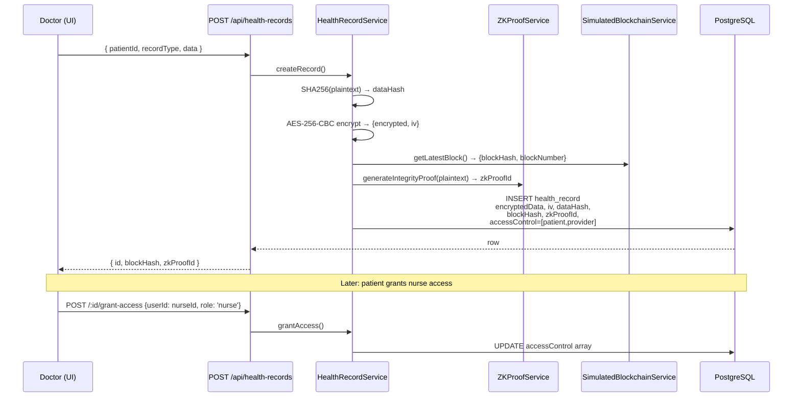

# 05 — Healthcare Records

## TL;DR

Patient health records are encrypted with **AES-256-CBC** before hitting the database, anchored to the blockchain by storing the latest block's hash, and protected by an **explicit access control list** (ACL). A SHA-256 integrity hash + a ZK integrity proof let any authorised party verify the record was never altered.

## Why blockchain + healthcare?

Healthcare data has three competing requirements that are hard to satisfy together:

| Requirement | Naïve approach fails because... |
|---|---|
| **Confidential** — only doctor/patient can read | A normal SQL row is readable by any DB admin |
| **Immutable** — auditable in legal disputes | A SQL row can be silently UPDATEed |
| **Granular access** — patient can grant/revoke specific providers | File systems are too coarse, JWT roles are global |

Our combination solves each:

| Requirement | Our mechanism |
|---|---|
| Confidential | AES-256-CBC encryption with per-record IV; key in env vars only |
| Immutable | SHA-256 hash of plaintext stored alongside; record is anchored to a block hash |
| Granular access | `accessControl: [{ userId, role, grantedAt }]` array; checked on every read |

## What gets stored where

```mermaid
flowchart LR
    subgraph Input
        P[Plaintext JSON<br/>e.g. diagnosis, dosage]
    end

    subgraph Encrypt[HealthRecordService.createRecord]
        H[dataHash = SHA256&#40;plaintext&#41;]
        E[encrypted = AES-256-CBC&#40;plaintext, key, iv&#41;]
        Z[zkProofId = ZK integrity proof]
    end

    subgraph Anchor[Blockchain anchor]
        L[latestBlock.hash]
        N[latestBlock.blockNumber]
    end

    subgraph DB[(health_records table)]
        ROW[encryptedData<br/>encryptionIv<br/>dataHash<br/>blockHash<br/>blockNumber<br/>zkProofId<br/>accessControl JSONB]
    end

    P --> H
    P --> E
    P --> Z
    Anchor --> ROW
    H --> ROW
    E --> ROW
    Z --> ROW
```

The DB *never* sees plaintext. The encryption key never sees the DB.

## Access control

Every read is gated:
```ts
const hasAccess = record.accessControl.some(ac => ac.userId === requesterId);
if (!hasAccess) return null;  // also logs to audit trail
```

Patients (role `patient`) and providers (role `provider`) start with access. The patient can `grantAccess()` to any other user, and **only the patient can `revokeAccess()`** — providers cannot kick the patient out.

## Integrity verification

Two layers:

1. **Hash check.** `verifyIntegrity()` decrypts the record, recomputes SHA-256, and compares with the stored `dataHash`. Mismatch → tampered.
2. **ZK proof.** A separate ZK integrity proof (see [03-zk-proofs.md](./03-zk-proofs.md)) was generated at create-time. Verifying it confirms the *commitment* still ties to the original data — useful when you want to confirm integrity without decrypting.

## Architecture



## Backend implementation

| Concern | File:line |
|---|---|
| Service | `src/services/HealthRecordService.ts` |
| AES-256-CBC encrypt | `encrypt()` ~line 22 |
| AES-256-CBC decrypt | `decrypt()` ~line 30 |
| Create + anchor + ZK | `createRecord()` ~line 41 |
| Access-controlled read | `getRecord()` ~line 98 |
| Grant access | `grantAccess()` ~line 131 |
| Revoke (patient-only) | `revokeAccess()` ~line 160 |
| Integrity verify | `verifyIntegrity()` ~line 178 |
| Controller | `src/controllers/healthRecordController.ts` |
| Entity | `src/entities/HealthRecord.ts` |
| Frontend | `ledger-link-frontend/app/dashboard/health/page.tsx` |

## API endpoints

| Method | Path | Auth | Purpose |
|---|---|---|---|
| POST | `/api/health-records` | user | Create + encrypt + anchor + ZK |
| GET | `/api/health-records/:id` | user (must be in ACL) | Read decrypted |
| GET | `/api/health-records/patient/:patientId` | user | List a patient's records (ACL-filtered) |
| POST | `/api/health-records/:id/grant-access` | patient/provider | Add a user to ACL |
| POST | `/api/health-records/:id/revoke-access` | patient only | Remove a user from ACL |
| GET | `/api/health-records/:id/verify` | user (in ACL) | Re-hash & confirm integrity |
| GET | `/api/health-records/stats/overview` | user | Counts by record type |

## Sample record (ciphertext form in DB)

```json
{
  "id": "11ee...",
  "patientId": "user-uuid-A",
  "providerId": "user-uuid-B",
  "recordType": "lab_result",
  "encryptedData": "8a2f9d3c1e... (hex)",
  "encryptionIv":  "7f3a1b2c... (16-byte hex)",
  "dataHash":      "d41d8cd98f...",   // SHA-256 of plaintext
  "blockHash":     "00ab12cd...",     // anchor
  "blockNumber":   1247,
  "zkProofId":     "8e9c-...",
  "accessControl": [
    { "userId": "user-uuid-A", "role": "patient",  "grantedAt": "..." },
    { "userId": "user-uuid-B", "role": "provider", "grantedAt": "..." }
  ],
  "status": "active"
}
```

## Demo walkthrough

1. Open **Health** tab → "Create Record" → fill in patient/provider/type/data.
2. Response shows `blockHash` (anchored) and `zkProofId`.
3. Open the record — UI auto-decrypts because you're in the ACL.
4. Log in as a different user → try to GET the same record → 404 (ACL filter denies, audit log captures the attempt).
5. Patient grants access to that user → they can now read it.
6. Click "Verify Integrity" → returns `valid: true`. Manually corrupt the row in DB → re-verify → `valid: false, message: "Record may have been tampered with"`.

## Why this is interesting academically

Standard EHR systems enforce access at the application layer only — anyone with DB access reads everything. Ledger Link encrypts at the storage layer, so even a full DB dump is unreadable. The blockchain anchor and ZK proof give cryptographic evidence of integrity that survives software bugs and DB-level changes. That combination — confidentiality + integrity + granular access + cryptographic auditability — is the trifecta health regulators (HIPAA, GDPR Article 32) actually ask for.
