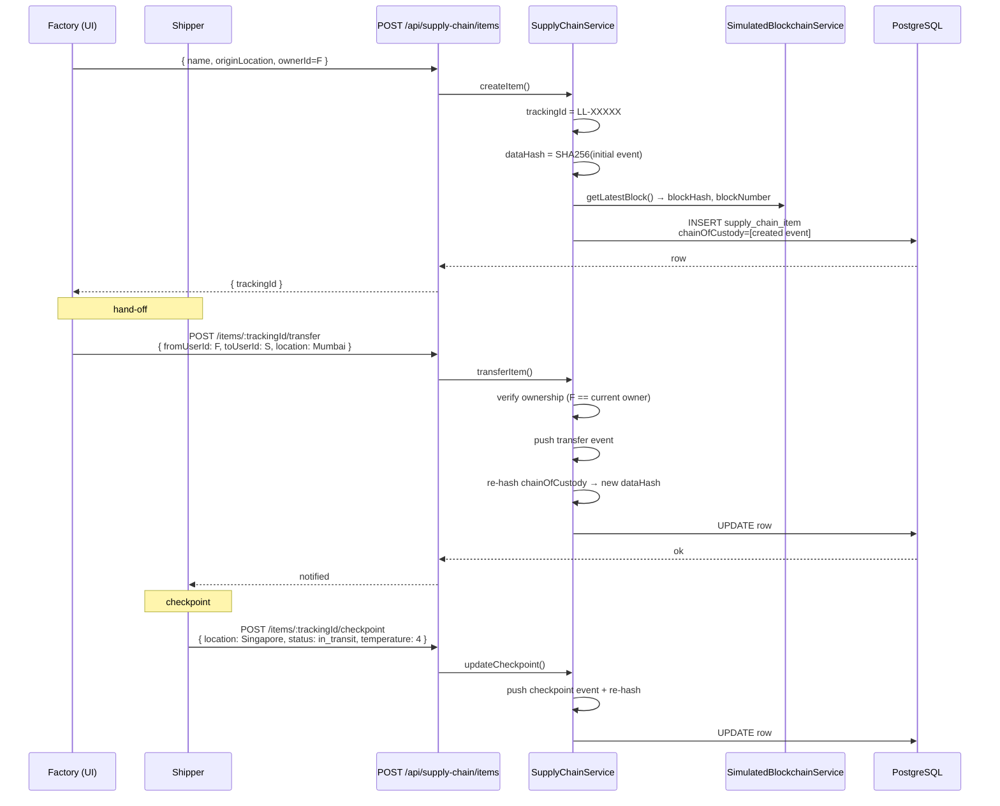

# 06 — Supply Chain Tracking

## TL;DR

Every physical item gets a unique `LL-<timestamp>-<random>` tracking ID. Every hand-off (transfer of ownership) and every checkpoint (location/temperature/humidity update) is appended to a **chain of custody** array. The whole chain is hashed (SHA-256) and anchored to the latest blockchain block. Tampering with any link is detectable.

## Why blockchain in supply chain?

Counterfeit drugs, "blood diamonds", food origin fraud — all are caused by the same gap: **no shared, untrusted-but-verifiable record** of where an item has been. Each party (factory, shipper, customs, retailer) keeps their own logs, and disputes degenerate into "their records vs ours".

A blockchain-backed chain of custody fixes this:

| Problem | Without blockchain | With Ledger Link |
|---|---|---|
| Forge an origin claim | Edit the spreadsheet | dataHash mismatch — provable forgery |
| Insert a phantom hand-off | Add a row to MySQL | breaks the SHA-256 chain integrity |
| Cold-chain breach hidden | Delete temperature logs | Each checkpoint is hashed; gap is visible |
| Disputed timestamps | Multiple "truth" sources | Block anchor pins the data to a specific block height |

## Concepts

### Tracking ID
`LL-<base36 timestamp>-<8 hex chars>` — guaranteed unique across the system, prefixed for readability, no PII.

### Chain of custody
An ordered array of hand-off events:
```ts
[
  { fromUserId: 'system',  toUserId: factory,  location: 'Mumbai',   action: 'created',       txHash: '...' },
  { fromUserId: factory,   toUserId: shipper,  location: 'Mumbai',   action: 'transfer',      txHash: '...' },
  { fromUserId: shipper,   toUserId: shipper,  location: 'Singapore', action: 'checkpoint:in_transit', txHash: '...', temperature: 4 },
  { fromUserId: shipper,   toUserId: retailer, location: 'Tokyo',    action: 'transfer',      txHash: '...' }
]
```

Each entry has its own `txHash = SHA-256(event payload)`. The whole array is then re-hashed into the item's top-level `dataHash` after every change. To tamper, you'd need to:
1. Change one event,
2. Re-hash that event,
3. Re-hash the entire chain,
4. Re-anchor to a block — **but you can't rewrite the block history**.

### Hand-off (transfer)
A transfer changes ownership and pushes a new `transfer` entry. We refuse the transfer unless `currentOwner === fromUserId` — you can't ship something you don't own.

### Checkpoint
Same chain, but ownership doesn't change — the current holder logs status (e.g. "passed customs", "temperature 4°C"). Includes optional `temperature` and `humidity` for cold-chain logistics.

## Architecture



## Backend implementation

| Concern | File:line |
|---|---|
| Service | `src/services/SupplyChainService.ts` |
| Tracking ID generator | `generateTrackingId()` ~line 17 |
| Create item | `createItem()` ~line 27 |
| Transfer (hand-off) | `transferItem()` ~line 79 |
| Checkpoint update | `updateCheckpoint()` ~line 121 |
| Integrity verify | `verifyIntegrity()` ~line 179 |
| Controller | `src/controllers/supplyChainController.ts` |
| Entity | `src/entities/SupplyChainItem.ts` |
| Frontend | `ledger-link-frontend/app/dashboard/supply-chain/page.tsx` |

## API endpoints

| Method | Path | Auth | Purpose |
|---|---|---|---|
| POST | `/api/supply-chain/items` | user | Register a new item |
| GET | `/api/supply-chain/items/:trackingId` | user | Read item + full chain |
| GET | `/api/supply-chain/my-items` | user | All items I currently own |
| POST | `/api/supply-chain/items/:trackingId/transfer` | current owner | Hand-off to new owner |
| POST | `/api/supply-chain/items/:trackingId/checkpoint` | user | Add checkpoint (location/temp/humidity) |
| GET | `/api/supply-chain/items/:trackingId/verify` | user | Re-hash chain & confirm integrity |
| GET | `/api/supply-chain/stats` | user | Aggregate counts by status |

## Sample item

```json
{
  "trackingId": "LL-LZBPQX72-A3F8B2C1",
  "name": "COVID-19 Vaccine Vial",
  "ownerId": "user-uuid-retailer",
  "originLocation": "Mumbai, India",
  "currentLocation": "Tokyo, Japan",
  "status": "delivered",
  "temperature": 4,
  "chainOfCustody": [
    { "fromUserId": "system",  "toUserId": "factory",  "action": "created",      "location": "Mumbai",    "timestamp": "...", "txHash": "..." },
    { "fromUserId": "factory", "toUserId": "shipper",  "action": "transfer",     "location": "Mumbai",    "timestamp": "...", "txHash": "..." },
    { "fromUserId": "shipper", "toUserId": "shipper",  "action": "checkpoint:in_transit", "location": "Singapore", "timestamp": "...", "txHash": "..." },
    { "fromUserId": "shipper", "toUserId": "retailer", "action": "transfer",     "location": "Tokyo",     "timestamp": "...", "txHash": "..." }
  ],
  "dataHash":   "9f2b...",
  "blockHash":  "00ab12cd...",
  "blockNumber": 1247
}
```

## Demo walkthrough

1. Login as **Factory** → **Supply Chain** → "Register Item" → name "Vaccine Vial", origin "Mumbai".
2. Item shows status `created`, chain of custody length 1.
3. Click "Transfer" → toUserId = Shipper, location = "Mumbai" → status flips to `in_transit`, chain length 2.
4. Login as **Shipper** → see item in inbox → "Add Checkpoint" → location "Singapore", temperature 4.
5. Click "Verify Integrity" → returns `{ valid: true, chainLength: 3 }`.
6. Manually corrupt one row in DB (e.g. change a `temperature`) → re-verify → `valid: false`.

## Where ZK proofs could plug in next

You could add a ZK membership proof at registration time: prove the item's serial number is in the manufacturer's authorised set, *without* publishing the entire serial-number list. That's the production extension we hint at in the demo Q&A.
