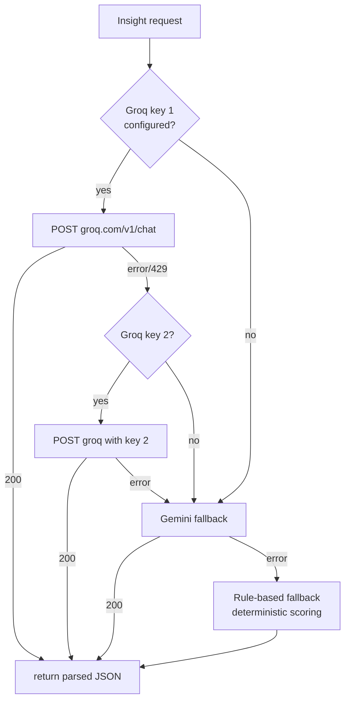

# 07 — AI Insights

## TL;DR

`AIService` analyses transactions, addresses and portfolios using a **Groq → Gemini → rule-based** fallback chain. It does anomaly detection (flagging risky txs), risk scoring (0-100 per address), portfolio insights (diversification suggestions) and natural-language summaries of activity.

## Why an AI layer?

A wallet of 500 transactions is a stack of opaque rows for a human to scan. An LLM-powered analyst can:

- Flag a tx as anomalous before it confirms (`high amount + new recipient + unusual hour`).
- Profile any address: total volume, common counterparties, risk level.
- Summarise a portfolio: "you're 80% in ETH — consider stablecoin diversification".
- Answer "what changed this week?" in plain English.

We use **Groq** (Llama 3.3 70B) as primary because it's fast (~500 ms inference) and free-tier generous. **Gemini** is the fallback. If both fail we still produce results from a deterministic rule-based scorer so the UI never goes blank.

## The fallback chain



Why rotate Groq keys? Their free tier is per-key rate-limited. Rotating between two free accounts effectively doubles throughput at no cost.

## What "anomaly detection" actually does

For each transaction we score against four heuristics, then ask the LLM to weigh them and assign `riskLevel`:

| Signal | Weight |
|---|---|
| Unusually large amount (vs user's median) | high |
| First-time recipient | medium |
| Off-hours timestamp (3-5 AM) | low |
| High frequency in last 60s (potential drain) | high |

The LLM's job is **synthesis** — turning numeric signals into a one-sentence explanation a human acts on, plus suggestions ("require 2FA for sends > $5k").

## Risk scoring (per address)

`/api/ai/risk-score/:address` returns `riskScore: 0-100`, with reasons:

| Range | Meaning |
|---|---|
| 0-25 | Low — established address, normal volume |
| 26-50 | Medium — some unusual signals |
| 51-75 | High — multiple flags |
| 76-100 | Critical — sanctions match / mixer-like behaviour / fraud pattern |

Used by the wallet UI to show a coloured chip next to recipient addresses on the Send page.

## Portfolio insights

`/api/ai/portfolio` looks at a user's wallet balances + recent activity and returns:
```json
{
  "summary": "Portfolio is heavily weighted toward ETH (78%)...",
  "diversificationScore": 42,
  "topHoldings": [{"token": "ETH", "percentage": 78}, {"token": "USDT", "percentage": 15}, ...],
  "recommendations": ["Consider 20% allocation to stablecoins", "..."]
}
```

## Backend implementation

| Concern | File:line |
|---|---|
| Service | `src/services/AIService.ts` |
| Groq call + key rotation | `callGroq()` ~line 81 |
| Gemini fallback | `callGemini()` |
| Anomaly detection | `detectAnomaly()` |
| Address risk profile | `getAddressRiskProfile()` |
| Portfolio insights | `getPortfolioInsights()` |
| Natural-language insights | `getInsights()` |
| Rule-based fallback | `getFallbackAnalysis()` (returns deterministic scoring when LLMs fail) |
| Controller | `src/controllers/aiController.ts` |
| Frontend | `ledger-link-frontend/app/dashboard/ai/page.tsx` |

## API endpoints

| Method | Path | Purpose |
|---|---|---|
| GET | `/api/ai/insights` | Natural-language summary of user's activity |
| GET | `/api/ai/portfolio` | Diversification + recommendations |
| GET | `/api/ai/risk-score/:address` | Risk profile for any address |
| GET | `/api/ai/analyze/:transactionId` | Single-tx anomaly check |
| POST | `/api/ai/detect-fraud` | Custom-payload analysis |

## Sample anomaly response

```json
{
  "isAnomaly": true,
  "riskScore": 72,
  "riskLevel": "high",
  "flags": [
    "Amount 12.5 ETH is 8x the user's 30-day median",
    "Recipient address never seen in user's history",
    "Sent at 04:12 local time"
  ],
  "aiAnalysis": "This transaction shows multiple red flags consistent with account compromise: a large amount sent to a brand-new recipient during off-hours.",
  "recommendations": [
    "Pause the transaction for 2-factor confirmation",
    "Verify recipient via secondary channel",
    "Check device session list for unauthorized logins"
  ]
}
```

## Env vars

| Var | Purpose |
|---|---|
| `GROQ_API_KEY` | Primary Groq key |
| `GROQ_API_KEY_2` | Secondary Groq key (auto-rotated on rate-limit) |
| `GEMINI_API_KEY` | Gemini fallback |

## Demo walkthrough

1. Send a "normal" transaction — 0.05 ETH to a known address.
2. Open **AI Insights** → "Recent Activity" → tx is summarised in one sentence ("normal payment to recurring contact").
3. Send a 10x larger amount to a new address at an unusual hour.
4. Refresh insights → flagged as `risk: high` with explicit reasons.
5. Visit **Portfolio** → diversification score + suggestions.
6. Stop both Groq + Gemini (e.g. revoke keys) → insights still load via rule-based fallback so the UI never breaks.

## Why this matters

Most blockchain explorers show raw data; users have to pattern-match in their head. An AI layer turns that data into actionable signals and natural-language explanations — the same value-add Etherscan's "Token Approvals" or Chainalysis-style risk panels offer commercial users, but powered by a free LLM.
