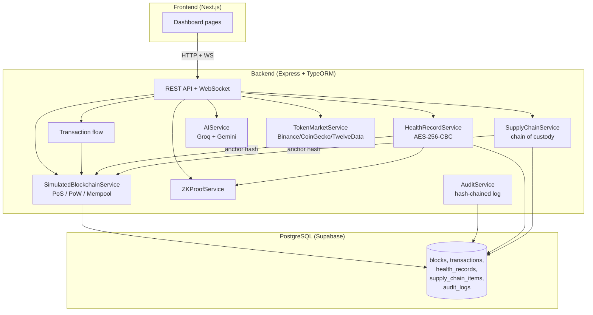

# Ledger Link — Feature Documentation

This folder is the **presentation-grade walkthrough** of every feature in Ledger Link. Each doc explains the *what*, the *why* (the problem we are solving), and the *how* (the cryptographic primitive or algorithm used), with mermaid flowcharts and code references.

Built for sharing with teammates and walking through during the project demo.

## Index

| # | Feature | Tab in UI | Doc |
|---|---------|-----------|-----|
| 1 | **Blockchain Miner** — PoW + PoS engine, Merkle trees, mempool, dynamic gas | Explorer / Live / Blocks | [01-blockchain-miner.md](./01-blockchain-miner.md) |
| 2 | **Transactions** — wallet send/receive, payment requests, lifecycle | Send / Receive / Transactions | [02-transactions.md](./02-transactions.md) |
| 3 | **Zero-Knowledge Proofs** — knowledge / range / membership / integrity | Privacy | [03-zk-proofs.md](./03-zk-proofs.md) |
| 4 | **Privacy & Audit Trail** — hash-chained audit log, RBAC, AES-256-CBC | Privacy / Audit | [04-privacy-audit.md](./04-privacy-audit.md) |
| 5 | **Healthcare Records** — encrypted EHR + on-chain integrity hash | Health | [05-healthcare.md](./05-healthcare.md) |
| 6 | **Supply Chain** — chain of custody, hand-off transfers, checkpoints | Supply Chain | [06-supply-chain.md](./06-supply-chain.md) |
| 7 | **AI Insights** — anomaly detection, risk scoring, portfolio analysis | AI Insights | [07-ai-insights.md](./07-ai-insights.md) |

## How everything fits together

## Cryptographic primitives used (cheat sheet)

| Primitive | Where used | Why |
|-----------|------------|-----|
| **SHA-256** | Block hashing, Merkle tree, audit chain, ZK commitments, integrity hashes | Industry-standard, collision-resistant one-way function |
| **AES-256-CBC** | Health record encryption | Symmetric block cipher; 256-bit key gives 2^256 brute-force resistance |
| **HMAC-SHA-256** (via Node `crypto`) | JWT signing | Authenticates token integrity |
| **bcrypt** | Password hashing | Slow by design; resists offline cracking |
| **Schnorr-style proofs (Fiat-Shamir)** | ZK proof of knowledge | Non-interactive; prover demonstrates knowledge without revealing the secret |
| **Hash chain** (linked SHA-256) | Audit log | Tamper-evident — changing any entry breaks every hash after it |
| **Merkle tree** | Block transaction summary | One root hash represents N transactions; enables compact proofs of inclusion |

## Reading order for the demo

1. Start with **01-blockchain-miner.md** — this is the foundation everything else anchors to.
2. **02-transactions.md** — shows how user actions become blocks.
3. **03-zk-proofs.md** + **04-privacy-audit.md** — the privacy layer.
4. **05-healthcare.md** + **06-supply-chain.md** — real-world use cases on top of the chain.
5. **07-ai-insights.md** — the analytics layer.
